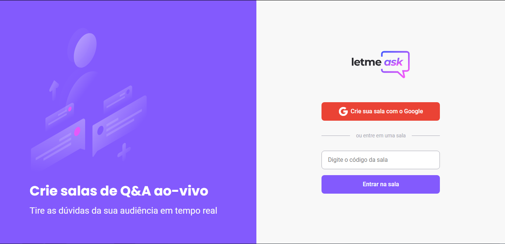

<h1 align="center">MyLink App</h1>

  

## Evento

Este é um projeto desenvolvido durante a [Next Level Week Together](https://nextlevelweek.com/), apresentada dos dias 20 a 27 de Junho de 2021.

## Projeto

Letmeask é perfeito para criadores de conteúdos poderem criar salas de Q&A com o seu público, de uma forma muito organizada e democrática..

## Tecnologias

- [React](https://reactjs.org/)
- [Firebase](https://firebase.google.com/)
- [TypeScript](https://www.typescriptlang.org/)

## Como executar

- clone o repositório
- instale as dependências com o `npm` ou `yarn`
- inicie o servidor com `npm run start` ou `yarn start`

## Informações adicionais

Você pode encontrar o layout do projeto neste [link](https://www.figma.com/file/u0BQK8rCf2KgzcukdRRCWh/Letmeask/duplicate)
